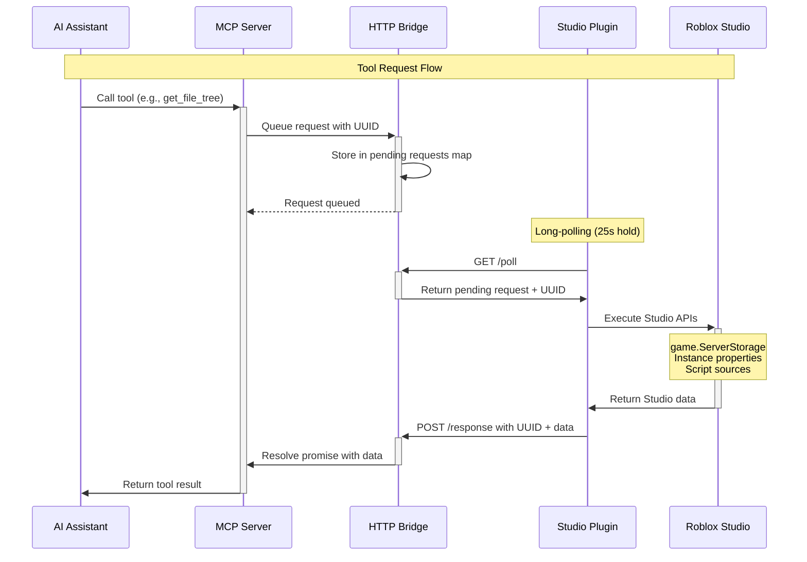

## Overview

Roblox Studio MCP uses a **dual-component architecture** to bridge the gap between AI assistants and Roblox Studio's sandboxed environment. Since AI assistants cannot directly access Studio's APIs, the system uses an HTTP bridge to enable seamless communication.

<Info>
  **Key Insight**: Roblox Studio's security model prevents external applications from directly accessing its APIs. The MCP architecture works around this by using HTTP as a communication protocol.
</Info>

## Architecture Components

The system consists of three main components:

### 1. MCP Server (Node.js/TypeScript)

**Location**: Runs on your local machine via `npx robloxstudio-mcp`

**Responsibilities**:
- Exposes 37+ tools to AI assistants via stdio (MCP protocol)
- Manages the HTTP bridge on `localhost:3002`
- Queues incoming requests from AI assistants
- Handles request/response lifecycle with 30-second timeouts
- Provides HTTP API endpoints for all tools

**Key Files**:
- `dist/index.js` - Main MCP server entry point
- `dist/http-server.js` - HTTP bridge implementation
- `dist/bridge-service.js` - Request queue manager
- `dist/tools/` - 37+ tool implementations

### 2. HTTP Bridge (localhost:3002)

**Purpose**: Communication layer between MCP server and Studio plugin

**Key Endpoints**:

| Endpoint | Method | Purpose |
|----------|--------|--------|
| `/health` | GET | Server health check |
| `/poll` | GET | Long-polling for pending requests (25s hold) |
| `/response` | POST | Plugin submits results |
| `/ready` | POST | Plugin connection notification |
| `/status` | GET | Connection status |
| `/mcp/*` | POST | Direct HTTP access to all tools |

**Features**:
- **Long polling**: Holds connections up to 25 seconds for instant response
- **Request queuing**: UUID-based request tracking
- **Connection monitoring**: Tracks plugin and MCP server activity
- **CORS enabled**: Allows cross-origin requests
- **50MB request limit**: Supports large payloads (scripts, trees)

### 3. Studio Plugin (Luau)

**Location**: `%LOCALAPPDATA%/Roblox/Plugins/MCPPlugin.rbxmx`

**Responsibilities**:
- Polls HTTP bridge via long-polling (instant response)
- Executes Roblox Studio API calls
- Returns results to HTTP bridge
- Provides visual status indicators
- Logs activity with copy/export functionality

**Key Features**:
- Modern UI with connection status visualization
- Activity logger with 200-entry buffer
- Exponential backoff for connection failures
- Client disconnect handling with request unclaiming
- Step-by-step connection status display

## Communication Flow



## Component Interaction

<CardGroup cols={2}>
  <Card title="MCP Server → HTTP Bridge" icon="arrow-right">
    - Queues requests with UUID
    - 30-second timeout per request
    - Tracks MCP server activity
    - Resolves/rejects promises
  </Card>
  
  <Card title="HTTP Bridge → Studio Plugin" icon="arrows-left-right">
    - Long-polling with 25s hold time
    - JSON request/response format
    - Connection status tracking
    - Request claiming mechanism
  </Card>
  
  <Card title="Studio Plugin → Roblox APIs" icon="code">
    - Direct API access via Luau
    - Service access (Workspace, etc.)
    - Instance manipulation
    - Script source reading/writing
  </Card>
  
  <Card title="AI Assistant → MCP Server" icon="robot">
    - stdio communication (MCP protocol)
    - 37+ specialized tools
    - Structured responses
    - Error handling
  </Card>
</CardGroup>

## Data Flow Example

Here's what happens when an AI assistant calls `get_file_tree`:

<Steps>
  <Step title="AI makes tool call">
    AI assistant invokes `get_file_tree` tool via MCP protocol
  </Step>
  
  <Step title="MCP server queues request">
    Server generates UUID, creates HTTP request object, stores in `BridgeService.pendingRequests` Map
  </Step>
  
  <Step title="Plugin polls and receives">
    Plugin's active `/poll` request immediately receives the pending work with UUID
  </Step>
  
  <Step title="Plugin executes Roblox APIs">
    Plugin recursively walks `game` hierarchy using `GetChildren()`, builds tree structure
  </Step>
  
  <Step title="Plugin responds">
    POSTs result to `/response` endpoint with UUID and tree data
  </Step>
  
  <Step title="MCP server resolves">
    Bridge service finds request by UUID, resolves promise, returns data to AI
  </Step>
</Steps>

## Why This Architecture?

<AccordionGroup>
  <Accordion title="Why not direct API access?">
    Roblox Studio runs in a sandboxed environment and doesn't expose APIs to external applications. The plugin running *inside* Studio is the only way to access these APIs.
  </Accordion>
  
  <Accordion title="Why HTTP instead of stdio?">
    Studio plugins can only communicate via HTTP requests. The plugin uses `HttpService:RequestAsync()` to talk to the bridge.
  </Accordion>
  
  <Accordion title="Why long polling instead of WebSockets?">
    Roblox's `HttpService` only supports HTTP requests, not WebSocket connections. Long polling (25s holds) provides near-instant response while staying within Studio's API constraints.
  </Accordion>
  
  <Accordion title="Why 30-second timeouts?">
    Balances responsiveness with complex operations. Large projects with thousands of instances can take time to traverse. The timeout prevents infinite hangs while allowing substantial work.
  </Accordion>
</AccordionGroup>

## Performance Considerations

<Warning>
  **Long-Running Operations**: Complex operations (full project trees with thousands of instances) can take 5-15 seconds. The 30-second timeout accommodates these cases.
</Warning>

### Optimization Strategies

1. **Request Queuing**: FIFO queue with UUID tracking prevents request duplication
2. **Long Polling**: Eliminates wasteful 500ms interval polling (v1.x)
3. **Connection Reuse**: HTTP keep-alive reduces connection overhead
4. **Payload Limits**: 50MB limit supports large script content and deep trees
5. **Exponential Backoff**: Failed connections retry with increasing delays (1.2x multiplier, max 5s)

## Security Model

<CardGroup cols={2}>
  <Card title="Local-Only" icon="house">
    All communication happens on `localhost`. No external servers involved.
  </Card>
  
  <Card title="HTTP Required" icon="lock">
    Plugin requires "Allow HTTP Requests" enabled in Game Settings → Security.
  </Card>
  
  <Card title="No Authentication" icon="shield-exclamation">
    Assumes trusted local environment. Anyone with localhost access can use the bridge.
  </Card>
  
  <Card title="Read/Write Access" icon="pen">
    Plugin has full Studio API access - can modify instances, scripts, and properties.
  </Card>
</CardGroup>

## Configuration

The architecture supports customization via environment variables and plugin settings:

```bash
# Environment Variables (MCP Server)
HTTP_SERVER_PORT=3002          # HTTP bridge port (default: 3002)
REQUEST_TIMEOUT=30000          # Request timeout in ms (default: 30000)
```

```lua
-- Plugin Configuration (plugin.luau)
serverUrl = "http://localhost:3002"  -- HTTP bridge URL
maxRetryDelay = 5                    -- Max exponential backoff delay
retryBackoffMultiplier = 1.2         -- Backoff multiplier
```

## Next Steps

<CardGroup cols={2}>
  <Card title="Communication Protocol" icon="arrows-left-right" href="/concepts/communication-protocol">
    Deep dive into request/response flow, long polling, and error handling
  </Card>
  
  <Card title="Plugin System" icon="plug" href="/concepts/plugin-system">
    Learn how the Studio plugin polls, executes, and logs activities
  </Card>
</CardGroup>